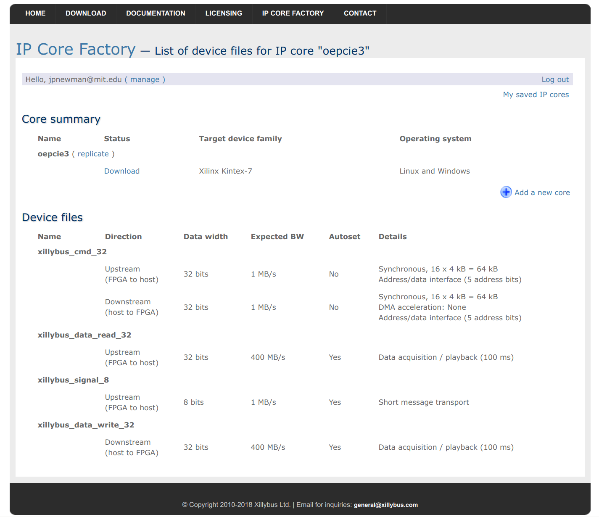

# `Xillybus` ONI Translation Layer

[Xillybus](http://xillybus.com/) is a company that provides closed-source (but
monetarily-free for academic use) FPGA IP cores as well as free and open-source
device drivers that abstract PCIe communication to the level of system IO
calls. For this reason, Xillybus IP Cores and drivers can be used as a high
performance PCIe-based backend. This ONI translation layer converts Xillybus's raw API into
ONI-compatible API by implementing all the functions in `onidriver.h`. Xillybus
has been replaced by an open source alternative, RIFFA, and is no longer used
by ONIX hardware.

The following steps show how to generate IP cores and obtain device drivers
that will function with `onidriver_xillybus` Both Windows and Linux hosts are
supported.

## Building the library
### Linux
```
make                # Build without debug symbols
sudo make install   # Install in /usr/local and run ldconfig to update library cache
make help           # list all make options
```

### Windows
Run the project in Visual Studio

## Driver Options
### `ONI_XILLYBUS_CONFIGSTREAMPATH`\*
Obtain path specifying config data stream.

| | |
|---------------------|--------------------------------------------------------------------|
| option value type   | `char *` |
| access              | R/W |
| option description  | A character string specifying the configuration stream path |
| default value       | /dev/xillybus_oni_config_32, \\\\.\\xillybus_oni_config_32 (Windows) |

### `ONI_XILLYBUS_SIGNALSTREAMPATH`\*
Obtain path specifying hardware signal data stream

| | |
|---------------------|--------------------------------------------------------------------|
| option value type   | `char *` |
| access              | R/W |
| option description  | A character string specifying the signal stream path |
| default value       | /dev/xillybus_oni_signal_8, \\\\.\\xillybus_oni_signal_8 (Windows) |

### `ONI_XILLYBUS_READSTREAMPATH`\*
Obtain path specifying input data stream.

| | |
|---------------------|--------------------------------------------------------------------|
| option value type   | `char *` |
| access              | R/W |
| option description  | A character string specifying the input stream path |
| default value       | /dev/xillybus_oni_input_32 \\\\.\\xillybus_oni_input_32 (Windows) |

### `ONI_XILLYBUS_WRITESTREAMPATH`\*
Obtain path specifying input data stream.

| | |
|---------------------|--------------------------------------------------------------------|
| option value type   | `char *` |
| access              | R/W |
| option description  | A character string specifying the output stream path |
| default value       | /dev/xillybus_oni_output_32, \\\\.\\xillybus_oni_output_32 (Windows) |


## Generating HDL IP Cores
1. Make a [Xillybus account](http://xillybus.com/ipfactory/signup)
1. Visit the [Xillybus IP Core Factory](http://xillybus.com/ipfactory/)
1. Fill out the following information in the IP Core Factory form
    - IP Core's Name: oepcie
    - Target device family: Xilinx Kintex 7
    - Intial template: Empty
    - Operating system: Windows and Linux OR Linux OR Windows depending on your requirements

	 

1. After the core has been generated, create 3 device files for the core with
   the following settings
    - `xillybus_oni_config_32`

    

    - `xillybus_oni_signal_8`

    

    - `xillybus_oni_input__32`

    

    - `xillybus_oni_output_32`

    
1. Generate the core for use in your host firmware.

## Obtaining Host Device Driver
### Linux
If you are using fairly recent Linux kernel, the driver is included
automatically. Otherwise, have a look at [Getting started with Xillybus on a
Linux
host](http://xillybus.com/downloads/doc/xillybus_getting_started_linux.pdf) for
manual installation instructions. The driver can be downloaded
[here](http://xillybus.com/downloads/xillybus.tar.gz).

### Windows
The Xillybus device driver will need to be manually associated with the PCIe
device. Installation instructions can be found in the [Getting started with
Xillybus on a Windows
host](http://xillybus.com/downloads/doc/xillybus_getting_started_windows.pdf).
The driver can downloaded
[here](http://xillybus.com/downloads/xillybus-windriver-1.2.0.0.zip).


