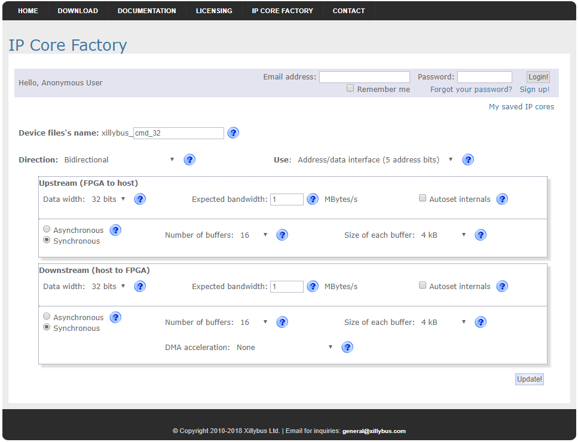
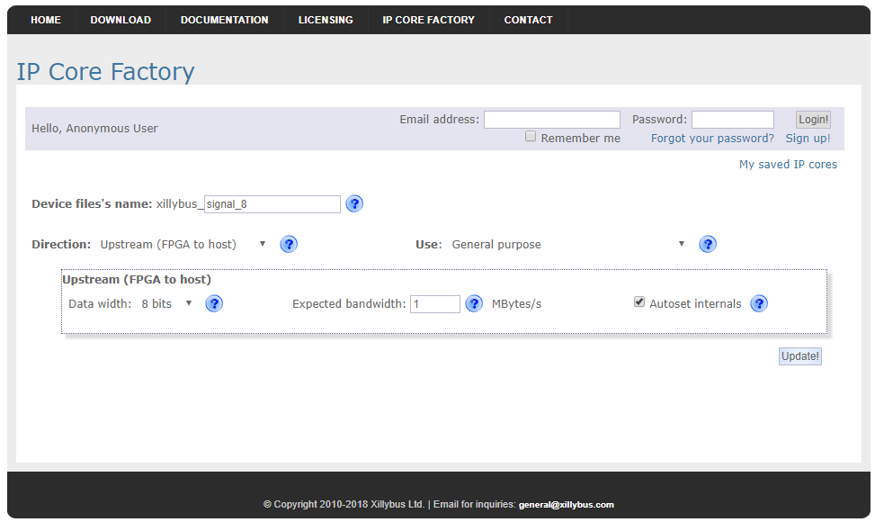
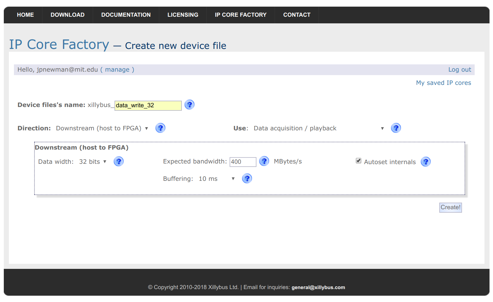

# `liboepcie` Xillybus Backend Guide

`liboepcie` is agnostic to implementation of the "communication backend" so
long it fulfils the interface requirements detailed in the [oepcie
specification](../spec/spec.pdf). This is because, ultimately, all
communication is handled using low-level system IO system calls (`read`,
`write`, `lseek`, etc.) that operate on file descriptors. For instance, both
the `signal` and the `read` communication channels can be implemented using
UNIX named pipes and the configuration channel can be implemented using a
normal file.  In fact, this is exactly how `liboepcie` is
[tested](../api/liboepcie)

[Xillybus](http://xillybus.com/) is a company that provides closed-source (but
monetarily-free for academic use) FPGA IP cores as well as free and open-source
device drivers that abstract PCIe communication to the level of system IO
calls. For this reason, Xillybus IP Cores and drivers can be used as a high
performance PCIe-based backend by `liboepcie`. A custom, completely open-source
solution is in the works, but it is currently not available. The following
steps show how to generate IP cores and obtain device drivers in order to use a
Xillybus PCIe backend with `liboepcie`.  Windows and Linux hosts are supported.

## Generating HDL IP Cores
1. Make a [Xillybus account](http://xillybus.com/ipfactory/signup)
1. Visit the [Xillybus IP Core Factory](http://xillybus.com/ipfactory/)
1. Fill out the following information in the IP Core Factory form
    - IP Core's Name: oepcie
    - Target device family: Xilinx Kintex 7
    - Intial template: Empty
    - Operating system: Windows and Linux OR Linux OR Windows depending on your requirements

	 

1. After the core has been generated, create 3 device files for the core with
   the following settings
    - `xillybus_cmd_32`

    

    - `xillybus_signal_8`

    

    - `xillybus_data_read_32`

    

    - `xillybus_data_write_32`

    
1. Generate the core for use in your host firmware.

## Obtaining Host Device Driver
### Linux
If you are using fairly recent Linux kernel, the driver is included
automatically. Otherwise, have a look at [Getting started with Xillybus on a
Linux
host](http://xillybus.com/downloads/doc/xillybus_getting_started_linux.pdf) for
manual installation instructions. The driver can be downloaded
[here](http://xillybus.com/downloads/xillybus.tar.gz).

### Windows
The Xillybus device driver will need to be manually associated with the PCIe
device. Installation instructions can be found in the [Getting started with
Xillybus on a Windows
host](http://xillybus.com/downloads/doc/xillybus_getting_started_windows.pdf).
The driver can downloaded
[here](http://xillybus.com/downloads/xillybus-windriver-1.2.0.0.zip).

