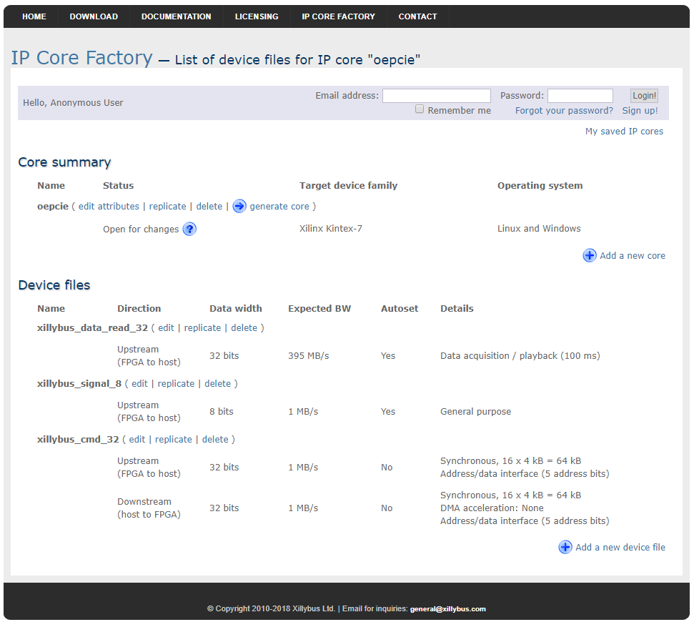
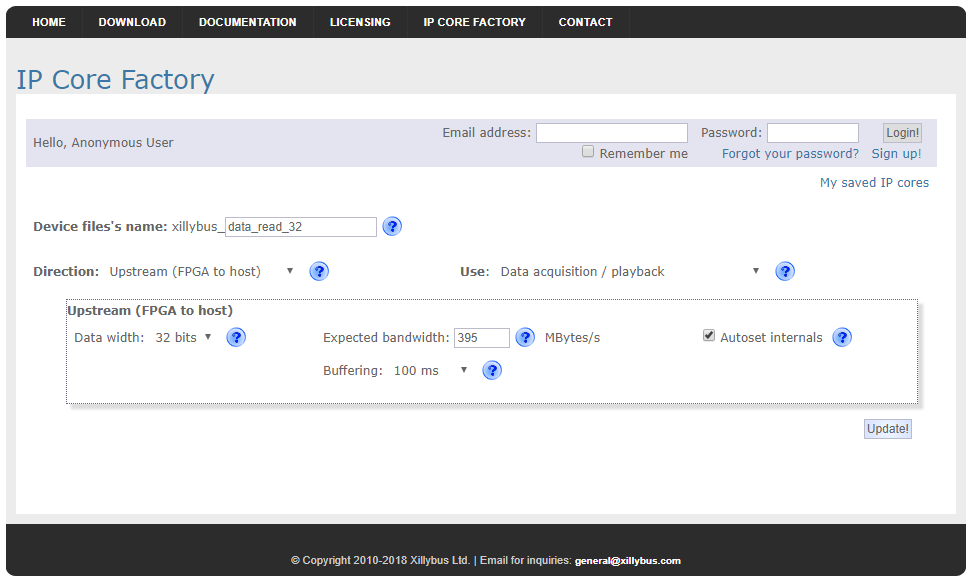

# `liboepcie` Xillybus Backend Guide

`liboepcie` is agnostic to implementation of the [communication backend](https://github.com/jonnew/open-ephys-pcie/blob/master/oepcie/Specification.md#fpgahost-communication) so long it fulfils the interface requirements detailed in the [oepcie specification](./Specification.md). This is because, ultimately, all communication is handled using low-level system IO system calls (`read`, `write`, `lseek`, etc.) that operate on file descriptors. For instance, both the `signal` and the `read` communication channels can be implemented using UNIX named pipes. The config channel can be implemented using a normal file. In fact, this is how `liboepcie` is [tested](https://github.com/jonnew/open-ephys-pcie/tree/master/oepcie/test).

[Xillybus](http://xillybus.com/) is a company that provides closed-source (but monetarily-free for academic use) FPGA IP cores as well as free and open-souce host device drivers that abstract PCIe communication to the level of low-level IO system calls. For this reason, Xillybus IP Cores and drivers can be used as a high performance PCIe-based backend by `liboepcie`. A custom, completely open-source solution is also possible, but is outside the scope and budget of this project currently. To use the Xillybus PCIe backend with `liboepcie`, use the following stepsm. Windows and Linux hosts are supported.

1. Make a [Xillybus account](http://xillybus.com/ipfactory/signup)
1. Visit the [Xillybus IP Core Factory](http://xillybus.com/ipfactory/)
1. Fill out the following information in the IP Core Factory form
    - IP Core's Name: oepcie
    - Target device family: Xilinx Kintex 7
    - Intial template: Empty
    - Operating system: Windows and Linux
	 
1. After the core has been generated, create 3 device files for the core with the following settings
    1. `xillybus_cmd_32`
    
    1. `xillybus_signal_8`
    
    1. `xillybus_data_read_32`
    
1. Generate the core for use in your host firmware.
